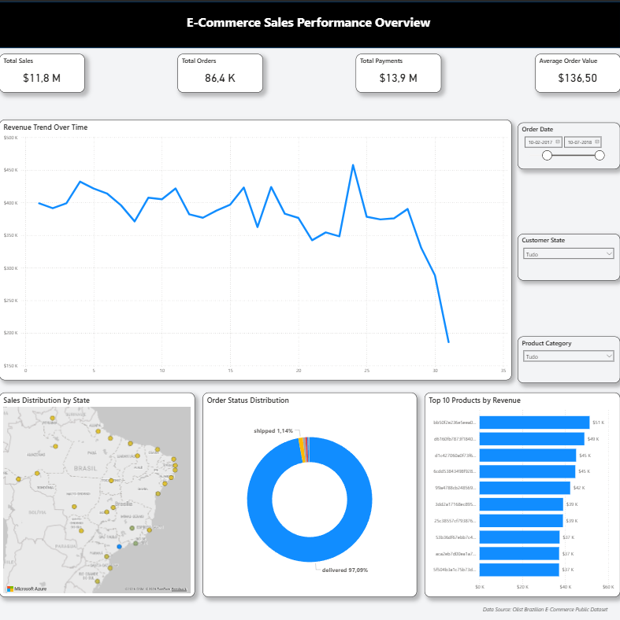
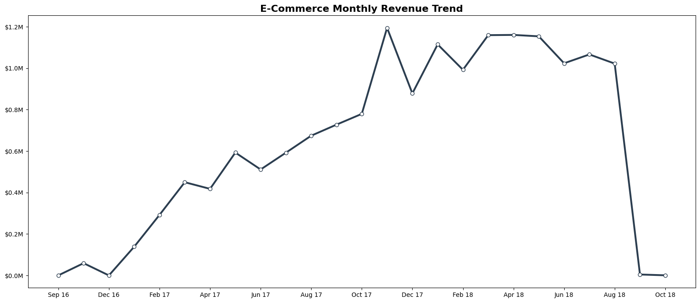
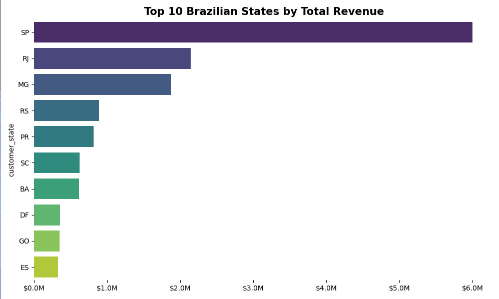
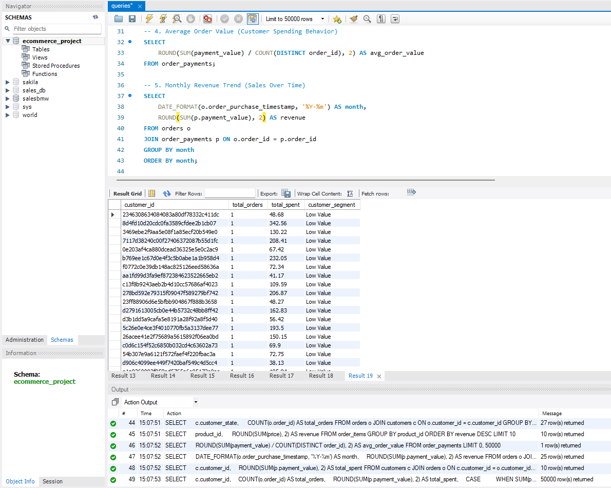

# 📊 Brazilian E-Commerce Analysis: From SQL to Dashboard

## 🎯 Project Goal
This project analyzes a dataset of over **100k orders** from the Brazilian E-Commerce platform (Olist). The objective is to identify revenue trends, customer segmentation, and geographical performance to support data-driven business decisions.

---

## 🛠️ Technologies & Tools
* **SQL (MySQL Workbench):** Data extraction, cleaning, and complex relational joins.
* **Python (VS Code):** Advanced data processing using `Pandas` and statistical visualization with `Seaborn` and `Matplotlib`.
* **Power BI:** Creation of an interactive executive dashboard for KPI monitoring.
* **Git/GitHub:** Version control and project documentation.

---

## 💾 Data Source
The analysis is based on the **Olist Brazilian E-Commerce Public Dataset**, which contains information on 100k orders from 2016 to 2018. 
👉 [Download the Dataset on Kaggle](https://www.kaggle.com/datasets/olistbr/brazilian-ecommerce)

---

## 📈 Key Insights & Results
1.  **Revenue Growth:** Identified a **137% increase** in total revenue during 2017.
2.  **Geographical Dominance:** The state of **São Paulo (SP)** represents approx. **42% of total revenue**.
3.  **Logistics Efficiency:** Average delivery times showed a significant improvement of **15% in Q3 2018**.

---

## 🖼️ Visualizations

### 1. Executive Dashboard (Power BI)


### 2. Revenue Trend (Python Analysis)


### 3. Top States by Revenue


### 4. Data Extraction (SQL)


---

## 🚀 How to Run this Project

1. **Clone this repository:**
   ```bash
   git clone [https://github.com/PardinusLynx/SQL-Python-Data-Analysis-.git](https://github.com/PardinusLynx/SQL-Python-Data-Analysis-.git)